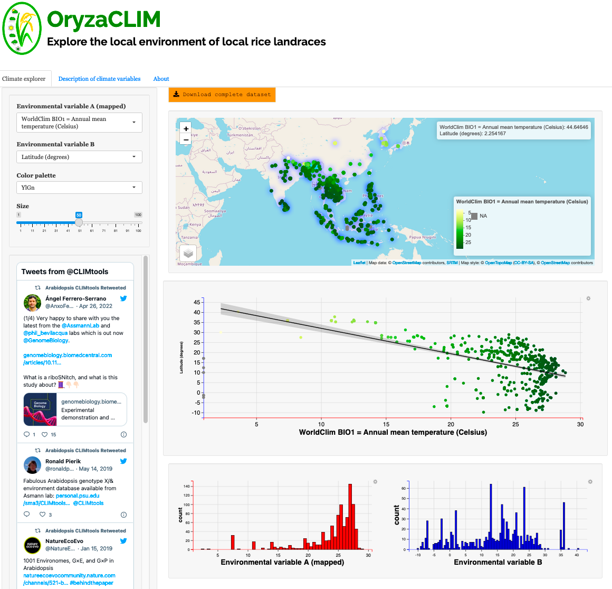

# [OryzaCLIM V1.0](https://gramene.org/CLIMtools/oryza_v1.0/OryzaCLIM/ "OryzaCLIM V1.0")
[**AraCLIM V2.0**](https://gramene.org/CLIMtools/oryza_v1.0/OryzaCLIM/OryzaCLIM-V1//) (https://gramene.org/CLIMtools/oryza_v1.0/OryzaCLIM/) is an SHINY component of [**Oryza CLIMtools**](https://gramene.org/CLIMtools/oryza_v1.0/) (https://gramene.org/CLIMtools/oryza_v1.0/) that describes the local environment of *Arabidopsis thaliana* providing an interactive spatial analysis web platform using [Leaflet](https://rstudio.github.io/leaflet/shiny.html). Data points represent the sites of collection of sequenced *Arabidopsis thaliana* accessions in an interactive world map. This update include sequenced the accessions sequenced as part of the 1001 Genomes Project and expands the dataset to include recently sequenced Chinese, African, and Madeiran accessions plus those in the 250K global Arabidopsis SNP array. The user can choose among the more than 400 geo-environmental variables to be displayed on the map, using a color gradient within the ranges and units detailed in the color palette within the map. Clicking on any of the data points on the map provides information on the selected accession, including its curation details, and the value of the chosen environmental variable for the selected accession.

[**OryzaCLIM V1.0**](https://gramene.org/CLIMtools/oryza_v1.0/OryzaCLIM/) allows  the inspection of two environment variables simultaneously using the [ggvis](https://ggvis.rstudio.com/interactivity.html) package in [SHINY](https://shiny.rstudio.com/). The more than 400 environmental variables that can be selected on the map can be compared with a second environmental variable that is user-specified; the two variables are displayed with a linear correlation provided based on data for the local environments of the 2,999 accessions. We also provide an interactive tabulated database describing the environmental variables available at [**OryzaCLIM V1.0**](https://gramene.org/CLIMtools/oryza_v1.0/OryzaCLIM/), including their source, units and period of data collection using the [DT](https://rstudio.github.io/DT/) package in [SHINY](https://shiny.rstudio.com/). 

Please visit the [Assmann lab](http://www.personal.psu.edu/sma3/) to learn about other interesting research topics.

## [Data availability](https://github.com/CLIMtools/AraCLIM-V2/tree/master/data)

The environmental dataset compiled in our study is available using the download buttom. Within the data folder as well as in the app itself, there is information on the descriptors and the source of each of the environmental parameters used. 

## Citation
**-Ferrero‑Serrano,Á, Sylvia, MM, Forstmeier, PC, Olson, AJ, Ware, D,Bevilacqua, PC & Assmann, SM** (2022). Experimental demonstration and pan‑structurome prediction of climate‑associated riboSNitches in Arabidopsis. Under review in Genome Biology.

